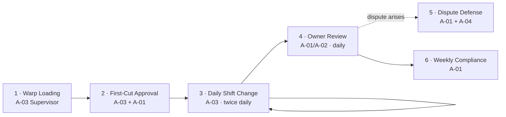

Read skill [user-journey-mapping](file:///Users/kumprad3/.copilot/skills/user-journey-mapping/SKILL.md?vscodeLinkType%3Dskill)

# Power Loom QC App — Full User Journey & Stories

I'm pulling the user-journey-mapping discipline forward here. Since we haven't formally locked actor / outcome / principle IDs yet, I'll establish them inline at the top so every story traces back. Compressed but complete.

---

## 0 · Established IDs (from our conversation)

### Actors

| ID | Actor | Notes |
|---|---|---|
| **A-01** | Owner (you) | Web review, master config, dispute defense |
| **A-02** | Partner | Web review, read-only operational view |
| **A-03** | Supervisor | Shop floor, mobile only, sole uploader |
| **A-04** | Customer | Passive — receives output, raises disputes |
| **A-05** | Future QC role | Parked for later |

### Value hypothesis

> **V-01** — A 30-second per-shift visual checkpoint, judged against two locked references, prevents order-wide debit notes that today are silent and costly.

### Outcomes

| ID | Outcome |
|---|---|
| **O-01** | Zero undetected defective rolls leave the floor |
| **O-02** | Drift / deviation caught within one shift, not 3–4 |
| **O-03** | Every roll has a permanent dated visual record |
| **O-04** | Customer disputes settled with evidence in seconds |
| **O-05** | Coaching signal — pattern of which loom / supervisor / shift drifts |
| **O-06** | Trust currency with customers (demoable, shareable) |
| **O-07** | Compliance visibility — % shifts photographed |
| **O-08** | Order-wide debit notes from undetected drift avoided |
| **O-09** | Two references (customer sample + first approved cut) captured at order start, never lost |
| **O-10** | Shift checkpoint takes ≤ 30s, doesn't disrupt floor operations |

### Anti-outcomes

| ID | Anti-outcome |
|---|---|
| **AO-01** | Supervisor skips uploads → app becomes shelfware |
| **AO-02** | Photos so poor they're useless for review |
| **AO-03** | App blocks production when device fails |

### Principles

| ID | Principle | Trade-off named |
|---|---|---|
| **P-01** | Loom-first navigation | Loses order-first discoverability; gains supervisor mental model fit |
| **P-02** | Auto-tag everything; humans confirm only | More upfront engineering; far less typing on shop floor |
| **P-03** | Soft-block, never hard-block | Allows non-compliance; preserves operational continuity |
| **P-04** | Two references, always | More setup per order; far stronger judgement basis |
| **P-05** | Three-up comparison is the unit of review | One screen does heavy lifting; demands good image UI |
| **P-06** | Paagu ID is the only join key with the sheet | Schema drift in sheet must not touch Paagu column |
| **P-07** | Mobile-first for capture, responsive web for review | Single codebase; some review tasks awkward on small screens |
| **P-08** | Simple modern aesthetic — information density low, type bold, color used sparingly | Less data per screen; far higher decision speed |

---

## 1 · Visual Language — "Simple Modern"

This is the design north star. Every screen we ever sketch must satisfy it.

| Dimension | Choice | Why |
|---|---|---|
| **Type** | One sans-serif family (Inter / Geist / similar). 3 sizes only: 32 / 16 / 12 | Hierarchy without decoration |
| **Weight** | Regular (400) and Semibold (600). Nothing else. | Forces meaningful emphasis |
| **Color** | Near-white background `#FAFAFA`, near-black text `#0A0A0A`, one accent (cobalt or deep emerald). Status colors used **only** for status (green / amber / red). | Color = information, not decoration |
| **Surface** | Flat. No gradients. No drop shadows. 1px hairline borders `#E5E5E5`. Subtle radius (8–12px). | Modern, calm, fast to render |
| **Photos** | Always full-bleed in their container, generous padding outside. Photos are the *content*; everything else is chrome. | This is a photo-centric app |
| **Iconography** | One icon set throughout (Lucide / Phosphor). Stroke 1.5px. Fabric-type icons custom but in the same visual language. | Visual coherence across 12 fabric types + UI icons |
| **Motion** | Almost none. 150ms ease on state changes. No carousels, no parallax, no celebratory animations. | Shop-floor users don't want delight; they want speed |
| **Density** | Mobile: one primary action visible per screen. Web: max 3 columns of cards, 80ch reading width on text. | Decision speed > data density |
| **Tone of voice** | Direct, advisory, no jargon. *"Upload Shift A photo"* not *"Tap here to capture quality assurance documentation"*. | Matches shop-floor reality |

This is the visual contract. We'll reference it as **VL** in stories.

---

## 2 · Journey Stages

Six stages, spanning multiple sessions and two actors. Phases 3 and 4 are the daily heartbeat; the rest are setup or rare-but-critical.

---

## 3 · Touchpoints (T-NN)

Derived from outcomes, not invented. Every touchpoint traces to ≥1 outcome.

| ID | Touchpoint | Surface | Serves |
|---|---|---|---|
| **T-01** | Supervisor login | Mobile | O-07 |
| **T-02** | Loom Floor home grid | Mobile | O-02, O-07, O-10 |
| **T-03** | Order Loading flow (customer sample capture) | Mobile | O-09 |
| **T-04** | First-Cut Approval flow | Mobile + Web | O-09, O-01 |
| **T-05** | Shift Photo Upload flow | Mobile | O-01, O-03, O-10 |
| **T-06** | "Previous shift not closed" banner | Mobile | O-07, AO-01 nudge |
| **T-07** | Owner login (email allowlist) | Web | O-04, O-05 |
| **T-08** | Review Queue | Web | O-01, O-02 |
| **T-09** | Three-Up Comparison Modal | Web | O-01, O-04 |
| **T-10** | Sample Library | Web | O-09 |
| **T-11** | Order Timeline (dispute view) | Web | O-04, O-06 |
| **T-12** | Compliance Dial / report | Web | O-07 |
| **T-13** | Daily WhatsApp/email digest (9pm) | External | O-07, AO-01 mitigation |
| **T-14** | Month switcher / sheet sync status | Web | (admin) |

---

## 4 · The Journey — stage-by-stage with happy + unhappy paths

### Stage 1 · Warp Loading (per order, ~40/month)

| Field | Detail |
|---|---|
| Goal | A-03 captures the customer reference for a freshly loaded warp |
| Touchpoint | T-03 |
| Action | Supervisor opens app → taps loom → "New order loaded" → fills design name, picks fabric type from icon grid, enters PPI, reed, colors → uploads customer-shared sample (camera, gallery, or document scan for paper specs) |
| System response | Saves to sample library against Paagu ID; shows green "Order set up" tile on loom |
| Emotion | Slight friction (this is the longest flow in the app, ~2 min) — accepted because rare |
| Principles | P-02, P-04, P-08 |
| Outcomes | O-09 |

**Unhappy paths**
- Customer sample is paper only → document-scan mode flattens, deskews, crops automatically.
- WhatsApp photo is blurry / wrong angle → "Add another reference" allows up to 3 photos.
- Supervisor doesn't know full specs at load time → save partial, app marks order as `setup incomplete`, blocks first-cut approval until specs filled.

---

### Stage 2 · First-Cut Approval (per order, once)

| Field | Detail |
|---|---|
| Goal | A-03 captures our own first-piece-off-the-loom approval baseline |
| Touchpoint | T-04 |
| Action | After first piece runs, supervisor takes photo → marks "first cut" → notifies owner → A-01 reviews on web → approves or rejects |
| System response | On approve: locks first-cut as the second reference; order moves to "active production"; future shift photos compared against both references |
| Emotion | Mild anxiety on supervisor side (waiting for owner) — mitigated by push notification to owner |
| Principles | P-04, P-05 |
| Outcomes | O-09, O-01 |

**Unhappy paths**
- Owner doesn't approve in time → order shows "awaiting first-cut approval" banner; production may continue but shift photos accumulate as unreviewed until approval lands.
- First cut rejected → supervisor is notified to redo; previous first-cut photo archived (never deleted).

---

### Stage 3 · Daily Shift Change (twice/day, every loom — the heartbeat)

This is the critical 30 seconds. Detailed here.

| Field | Detail |
|---|---|
| Goal | A-03 closes out shift just ended with photo + tag |
| Touchpoint | T-02 → T-05 |
| Action | Supervisor opens app at 8am → Loom Floor shows L1–L8 tiles, each with a small red dot if previous shift not closed → taps loom → big "Take Shift Photo" button → camera → 1–3 photos → confirms auto-tagged (date, shift, loom, order) → optional flag + note → submit |
| System response | Saves photo with tags; tile turns green; updates compliance counter; if flagged, shoots straight into review queue with priority |
| Emotion | Should feel routine, fast, frictionless — like clocking in |
| Principles | P-01, P-02, P-03, P-07, P-08 |
| Outcomes | O-01, O-02, O-03, O-07, O-10 |

**Unhappy paths**
- Shift A ended but no one uploaded → at 8am next day, Shift B start shows red banner *"Previous shift not closed — upload now or override"*. Override allowed (P-03), recorded.
- Phone has no signal → app stores photo offline, queues for upload, syncs when back.
- Supervisor uploads photo for wrong loom → "Edit" button on My Uploads list within 12h.
- Photo blurry → 1-second preview with "use anyway / retake".
- Phone dies → kiosk/laptop fallback at office can upload using camera or last shop-floor photo from WhatsApp.

---

### Stage 4 · Owner Review (daily, ~5–15 min)

| Field | Detail |
|---|---|
| Goal | A-01 or A-02 reviews pending shift photos against references |
| Touchpoint | T-08 → T-09 |
| Action | Owner logs in → sees Review Queue (newest at top, flagged ones boosted) → taps row → Three-Up modal: customer sample \| first cut \| shift photo, all zoomable → one-tap Approve / Flag / Reject + reason picker |
| System response | Logs decision; if flagged or rejected, sends WhatsApp/email to supervisor with reason; updates order timeline |
| Emotion | Fast at first, deliberate on flagged items |
| Principles | P-04, P-05, P-08 |
| Outcomes | O-01, O-02, O-05 |

**Unhappy paths**
- Image won't load → graceful retry, original photo never lost.
- Owner unsure → "Defer" option holds for partner second opinion.
- Reject after multiple shifts already produced → cascade alert: "Last clean shift was Shift 3. Shifts 4, 5 also pending review." (= the order-wide debit risk).

---

### Stage 5 · Dispute Defense (rare, decisive)

| Field | Detail |
|---|---|
| Goal | A-01 defends against a customer-raised debit note using the visual record |
| Touchpoint | T-11 |
| Action | Owner picks order → Order Timeline shows: customer sample (top) + first approved cut + every shift photo in chronological strip + approval markers + flagged items + notes → exports as PDF or shareable read-only link |
| System response | Generates watermarked, dated PDF / link |
| Emotion | High stakes, but the screen makes the case for itself |
| Principles | P-04, P-05, P-08 |
| Outcomes | O-04, O-06, O-08 |

**Unhappy paths**
- Gaps in timeline (missed shifts) → visible. Honest. Better to know than to fake.
- Customer rejects link access → PDF export remains.

---

### Stage 6 · Weekly Compliance Check (owner, ~2 min/week)

| Field | Detail |
|---|---|
| Goal | A-01 catches uploading drift before it becomes habit |
| Touchpoint | T-12 + T-13 |
| Action | Owner opens compliance dial → sees % shifts photographed this week → tap drills to missing shifts list |
| System response | Highlights patterns (e.g., L7 Shift B chronically missed) |
| Emotion | Calm if green, sharp if red |
| Principles | P-03, P-08 |
| Outcomes | O-07 |

**Unhappy paths**
- Compliance dropping → digest gets louder; owner has data to coach supervisor.

---

## 5 · User Stories (S-NN)

Format: **S-NN** *(happy/unhappy)*: *"As <A-NN>, I want to <action> so that <O-NN>."* — with `principles · outcomes · touchpoint · acceptance criteria`.

### Stage 1 · Warp Loading

**S-01** *(happy)*: As **A-03**, I want to register a newly loaded warp with design, fabric type, and specs, so that **O-09** is realized.
- principles: P-02, P-04, P-08 · outcomes: O-09 · touchpoint: T-03
- AC: Paagu ID auto-pulled from sheet · fabric type picker shows all 12 icons · PPI/Reed numeric, colors multi-select · save creates sample library entry · entry visible to A-01 within 5s

**S-02** *(happy)*: As **A-03**, I want to capture the customer-shared sample (camera, gallery, or document scan) so that **O-09** is realized.
- principles: P-04 · outcomes: O-09 · touchpoint: T-03
- AC: 3 input modes available · up to 3 reference photos · document-scan auto-deskews · photos bound to Paagu ID · originals never overwritten

**S-03** *(unhappy)*: As **A-03**, I want to save a partial setup when full specs aren't yet known, so that I can continue work without losing what I have. *(serves O-09 indirectly)*
- principles: P-03 · outcomes: O-09 · touchpoint: T-03
- AC: order saves with `setup incomplete` flag · flag visible on Loom Floor · first-cut approval blocked until complete

### Stage 2 · First-Cut Approval

**S-04** *(happy)*: As **A-03**, I want to upload the first cut and request approval, so that **O-09** lock-in for production reference is realized.
- principles: P-04 · outcomes: O-09 · touchpoint: T-04
- AC: photo + optional note · A-01 receives push/email · order state moves to `awaiting first-cut approval`

**S-05** *(happy)*: As **A-01**, I want to approve or reject the first cut from web, so that **O-01** baseline is locked.
- principles: P-04, P-05 · outcomes: O-01, O-09 · touchpoint: T-04
- AC: side-by-side with customer sample · one-tap approve/reject + reason · approval timestamps & locks reference · supervisor notified

**S-06** *(unhappy)*: As **A-03**, I want to redo the first cut if rejected, so that **O-09** is satisfied with a cleaner baseline.
- principles: P-04 · outcomes: O-09 · touchpoint: T-04
- AC: previous attempt archived, not deleted · new upload allowed · order remains in `awaiting first-cut` state

### Stage 3 · Daily Shift Change

**S-07** *(happy)*: As **A-03**, I want to see all looms at a glance with last-shift status, so that **O-07** and **O-10** are realized.
- principles: P-01, P-08 · outcomes: O-07, O-10 · touchpoint: T-02
- AC: tiles for L1–L20 (scalable) · shows active order, fabric icon, last shift photo timestamp · red dot if previous shift unclosed · loads in <2s

**S-08** *(happy)*: As **A-03**, I want to close out a shift in under 30 seconds with auto-tagged photo, so that **O-01**, **O-03**, **O-10** are realized.
- principles: P-01, P-02, P-07, P-08 · outcomes: O-01, O-03, O-10 · touchpoint: T-05
- AC: ≤4 taps from app open to submit · date/loom/order auto-tagged · shift auto-suggested by time, editable · 1–3 photos · submit completes in <2s on 4G

**S-09** *(happy)*: As **A-03**, I want to flag a concern at upload without judging it myself, so that **O-02** is realized via owner review.
- principles: P-03 · outcomes: O-02 · touchpoint: T-05
- AC: optional ⚠️ flag · free-text note up to 280 chars · flagged uploads boosted in review queue

**S-10** *(unhappy)*: As **A-03**, I want my upload to succeed even with no signal, so that **AO-01** is mitigated.
- principles: P-03 · outcomes: O-07 · touchpoint: T-05
- AC: photo + tags stored locally · queued for sync · status badge "pending sync" · auto-uploads when online · survives app restart

**S-11** *(unhappy)*: As **A-03**, I want a soft warning (not a block) when previous shift is unclosed, so that **AO-01** is mitigated without halting work.
- principles: P-03 · outcomes: O-07 · touchpoint: T-06
- AC: red banner shown · "upload now" and "override" both available · override is logged with timestamp + reason

**S-12** *(unhappy)*: As **A-03**, I want to fix an upload mistake (wrong loom, wrong shift) within 12h, so that the record remains accurate (serves O-03).
- principles: P-02 · outcomes: O-03 · touchpoint: T-05
- AC: edit window 12h · edits logged in audit trail · original retained

### Stage 4 · Owner Review

**S-13** *(happy)*: As **A-01**, I want a queue of pending shifts with flagged ones boosted, so that **O-02** is realized.
- principles: P-05, P-08 · outcomes: O-02 · touchpoint: T-08
- AC: sort by flagged > newest · filter by loom, customer, fabric type, status · pending count visible

**S-14** *(happy)*: As **A-01**, I want to compare shift photo against both references in one screen, so that **O-01** is realized.
- principles: P-04, P-05, P-08 · outcomes: O-01 · touchpoint: T-09
- AC: three images side-by-side · pinch/scroll-zoom independent or synced · spec strip (PPI/Reed/colors/fabric icon) visible · approve/flag/reject + reason in 1 tap

**S-15** *(happy)*: As **A-02**, I want read-only review access so that I can support **O-02** without changing decisions.
- principles: P-05 · outcomes: O-02 · touchpoint: T-08, T-09
- AC: partner role can view, comment, defer · cannot approve/reject

**S-16** *(unhappy)*: As **A-01**, I want a cascade alert when I reject a shift, so that **O-08** is realized by checking shifts since last clean one.
- principles: P-05 · outcomes: O-02, O-08 · touchpoint: T-09
- AC: on reject, app shows all unreviewed/approved shifts since last rejection-free baseline · supervisor notified

### Stage 5 · Dispute Defense

**S-17** *(happy)*: As **A-01**, I want a chronological visual timeline of an order, so that **O-04** and **O-06** are realized.
- principles: P-04, P-05, P-08 · outcomes: O-04, O-06 · touchpoint: T-11
- AC: customer sample header · first cut · shift photos chronologically · approval markers · flag/reject markers · timestamps · weaver/supervisor names

**S-18** *(happy)*: As **A-01**, I want to export the timeline as a watermarked PDF or share a read-only link, so that **O-04** lands with the customer.
- principles: P-08 · outcomes: O-04, O-06 · touchpoint: T-11
- AC: PDF generated in <10s · watermarked with order ID + date · link expires after configurable window · access logs kept

### Stage 6 · Weekly Compliance

**S-19** *(happy)*: As **A-01**, I want a single compliance number per week (% shifts photographed) with drill-down, so that **O-07** is realized.
- principles: P-08 · outcomes: O-07 · touchpoint: T-12
- AC: dial visible on web home · tap drills to missing shifts list · trend vs previous 4 weeks

**S-20** *(happy)*: As **A-01**, I want a 9pm daily digest on WhatsApp/email, so that **AO-01** is mitigated proactively.
- principles: P-03 · outcomes: O-07 · touchpoint: T-13
- AC: summary: shifts photographed / total · missing shifts listed by loom · sent at 21:00 IST · opt-out per channel

### Cross-cutting

**S-21** *(happy)*: As **A-01**, I want my Google Sheet to remain the source for orders, customers and loom assignment via Paagu ID, so that I keep my existing automation.
- principles: P-06 · outcomes: O-09 · touchpoint: T-14
- AC: app reads sheet by header name (not column position) · sync runs every N minutes for current month · past months frozen · sheet health screen reports unmapped columns

**S-22** *(happy)*: As **A-01**, I want allowlisted email-based access only, so that confidentiality is preserved.
- principles: P-06 · outcomes: (security · cross-cutting) · touchpoint: T-07
- AC: Google sign-in or email OTP · allowlist of {owner, partner(s), supervisor} · roles: owner / partner / supervisor / (qc — future) · session expiry 7d

**S-23** *(draft)* — *AI-assisted automatic flagging of obvious deviations between shift photo and references.* Held in draft: out of v1, requires AO-NN review (false-positive risk) before promotion.

---

## 6 · Traceability Matrix

`S-NN × O-NN × P-NN` — every committed story has at least one outcome and one principle.

| Story | Outcomes | Principles |
|---|---|---|
| S-01 | O-09 | P-02, P-04, P-08 |
| S-02 | O-09 | P-04 |
| S-03 | O-09 | P-03 |
| S-04 | O-09 | P-04 |
| S-05 | O-01, O-09 | P-04, P-05 |
| S-06 | O-09 | P-04 |
| S-07 | O-07, O-10 | P-01, P-08 |
| S-08 | O-01, O-03, O-10 | P-01, P-02, P-07, P-08 |
| S-09 | O-02 | P-03 |
| S-10 | O-07 | P-03 |
| S-11 | O-07 | P-03 |
| S-12 | O-03 | P-02 |
| S-13 | O-02 | P-05, P-08 |
| S-14 | O-01 | P-04, P-05, P-08 |
| S-15 | O-02 | P-05 |
| S-16 | O-02, O-08 | P-05 |
| S-17 | O-04, O-06 | P-04, P-05, P-08 |
| S-18 | O-04, O-06 | P-08 |
| S-19 | O-07 | P-08 |
| S-20 | O-07 | P-03 |
| S-21 | O-09 | P-06 |
| S-22 | (security cross-cut) | P-06 |
| **S-23 [draft]** | — | — |

**Coverage check:** every O-NN appears in ≥1 committed story. ✅ AO-01, AO-02, AO-03 each addressed by ≥1 unhappy-path story (S-10, S-11; quality preview is part of S-08 AC; S-10 covers device failure). ✅

---

## 7 · Open items / risk register

- **S-23 (AI auto-flagging)** — held in draft; needs explicit AO entry for false-positive cost before promotion.
- **AO-02 (photo quality)** — partly mitigated in S-08 AC ("preview, retake or use anyway"). Worth a dedicated story if early users hit it often.
- **Sheet column-evolution contract** — S-21 says "header-name based"; needs a sheet health screen spec and an alias config file (parking-lot story for v1.1).
- **Supervisor onboarding** — no story yet for "first-time supervisor learns the app". Likely a 3-screen tour, parked for v1.

---

## What's next, naturally

We have: outcomes, principles, journey, touchpoints, 22 lego-ready stories + 1 draft, traceability, visual language. This is a buildable spec.

Two candidate next moves:
1. **Solution dossier** — package this whole thread (problem → outcomes → principles → journey → stories → 2–3 build-sequencing options) into one handoff doc.
2. **Concrete wireframe for T-02 (Loom Floor) or T-09 (Three-Up Comparison)** — the two screens that carry the most weight.

Tell me which.